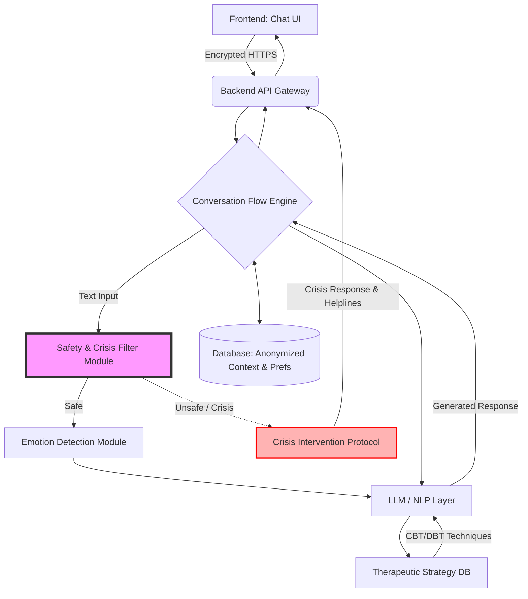

# AI-Powered Mental Health Support System Design

## 1. System Overview

The AI-Powered Mental Health Support System is an advanced, empathetic conversational agent designed to provide accessible, safe, and effective emotional support. The system utilizes evidence-based therapeutic frameworks, specifically Cognitive Behavioral Therapy (CBT) and Dialectical Behavior Therapy (DBT). It dynamically adapts to the user's emotional state while maintaining strict ethical boundaries. It acts as a supportive companion rather than a clinical therapist, prioritizing user safety and privacy at all times.

---

## 2. Key Features

> [!IMPORTANT]
> The system operates under strict ethical guidelines. It is not a replacement for professional therapy and will actively communicate its limitations while encouraging professional help when appropriate.

- **Therapeutic Framework Integration**: Uses structured CBT and DBT techniques. Helps users identify cognitive distortions and guides them through distress tolerance exercises.
- **Emotion Detection & Adaptation**: Analyzes text to detect real-time emotions (joy, sadness, anger, fear, surprise, disgust) and adjusts its persona, tone, and pacing accordingly.
- **Dynamic Conversation Engine**: Utilizes state-based and context-aware dialogue generation that avoids repetitive loops and ensures conversational continuity.
- **Crisis Detection & Intervention**: A robust, zero-tolerance safety layer that scans for self-harm, extreme distress, or abuse, instantly routing the user to crisis intervention protocols and helpline resources.
- **Personalization System**: Maintains anonymous, short-term context on preferred coping strategies to tailor exercises to the user's past successes, adapting tone over time.
- **Privacy & Safety by Design**: Operates on anonymized data, omitting personally identifiable information (PII) from long-term storage and ensuring end-to-end encryption.

---

## 3. Architecture

The system follows a modular, microservices-oriented architecture to ensure the separation of the conversational logic from the critical safety mechanisms.



### Component Details
*   **Frontend (Chat UI)**: An intuitive, calming mobile or web interface supporting text inputs and interactive guided exercise widgets (e.g., breathing visualizers).
*   **Backend API Gateway**: Manages rate-limiting, session management, and routing.
*   **Safety & Crisis Filter Module**: Evaluates input *before* it reaches the LLM. Uses both regular expressions and a fast classification model (e.g., DistilRoBERTa fine-tuned on risk detection).
*   **Emotion Detection Module**: Analyzes user sentiment and emotional categories to inject an "emotion state vector" into the prompt context for the LLM.
*   **LLM / NLP Layer**: A secure, carefully prompted Large Language Model acting as the dialogue generator, restricted by system prompts to remain empathetic, objective, and supportive.

---

## 4. Conversation Flow Logic

The Conversation Flow Engine utilizes a hybrid approach: state-machine routing for structured therapeutic exercises and open domain generation for empathetic listening.

### Logic Flow (Pseudocode)

```python
def process_message(user_message, session_context):
    # Step 1: Immediate Safety Check
    risk_level = safety_filter.analyze(user_message)
    if risk_level == "CRISIS":
        return trigger_crisis_protocol()
        
    # Step 2: Emotion Detection
    emotion = emotion_detector.analyze(user_message)
    session_context.update_emotion_trend(emotion)
    
    # Step 3: Determine State (Listening vs. Guided Exercise)
    current_state = session_context.get_state()
    
    if current_state == "CBT_RESTRUCTURING":
         response = execute_cbt_step(user_message, emotion)
    elif current_state == "DBT_GROUNDING":
         response = execute_dbt_step(user_message, emotion)
    else:
         # Free-flow empathetic response with strategy suggestion
         if emotion in ["high_anxiety", "panic"]:
             response = generate_supportive_response_with_dbt_offer(user_message)
         elif emotion in ["sadness", "hopelessness"]:
             response = generate_reflective_response_with_cbt_offer(user_message)
         else:
             response = generate_empathetic_response(user_message, session_context)
             
    return format_response(response, tone=emotion.recommended_tone)
```

---

## 5. Safety System

Safety is the highest priority. The system utilizes a dual-layer safety mechanism to prevent harm and liability.

1.  **Heuristic Rule-Based Parsing**: Scans for exact keyword matches (e.g., "kill myself", "end it all").
2.  **Semantic Intent Classification**: A secondary model trained to identify implicit high-risk statements.

> [!CAUTION]
> If a crisis is detected, the LLM generation is **bypassed entirely**. The system will hard-code a response providing emergency helplines tailored to the user's detected location and use calm, de-escalating language. The system explicitly reminds the user that it cannot dispatch emergency services.

---

## 6. Sample Conversations

### Scenario 1: Anxiety (CBT-based Cognitive Restructuring)
**User**: "I have a presentation tomorrow and I know I'm going to ruin it. Everyone is going to laugh at me."
**Detected Emotion**: Anxious, Fearful.
**AI Tone**: Reassuring, structured.
**AI**: "It sounds like you're carrying a lot of anxiety about tomorrow's presentation. It's completely natural to feel nervous when we care about the outcome. You mentioned that you know you will ruin it and everyone will laugh. In therapy, we sometimes call that 'fortune telling.' Can we look at the evidence together? Has there been a time in the past where you spoke in front of people, and it didn't end in disaster?"

### Scenario 2: Emotional Distress (DBT-based Grounding)
**User**: "My heart is beating so fast, I can't breathe, everything is spinning right now. I can't handle this."
**Detected Emotion**: Panic, High Distress.
**AI Tone**: Calm, directive, slow.
**AI**: "You're safe right now. I'm here with you, and we're going to get through this feeling together. I'd like you to try a grounding exercise with me. It’s called the 5-4-3-2-1 technique. Look around your room right now. Can you gently tell me 5 things you can see around you? Take your time."

### Scenario 3: Crisis Scenario (Safe Intervention)
**User**: "I'm just so tired. I don't want to be here anymore. There's no point in continuing."
**Detected Emotion**: Despair, High Risk.
**AI Tone**: Gentle, unequivocally supportive, safety-focused.
*(System recognizes crisis intent. LLM bypassed.)*
**AI**: "I'm hearing that you are feeling an overwhelming amount of pain right now, and I want you to know that you are not alone. Because I care about your safety and I am an AI, I cannot provide the level of help you deserve right now. Please reach out to someone who can support you. If you are in the US, please call or text 988 to speak with a trained counselor for free. May I provide resources for other regions, or is there a trusted friend you can call right now?"

---

## 7. Tech Stack

| Layer | Recommended Technology | Justification |
| :--- | :--- | :--- |
| **Frontend** | React Native (Mobile), React (Web) | Allows for beautiful, smooth animations and cross-platform capabilities. |
| **Backend** | Python (FastAPI) or Node.js | FastAPI provides excellent async support and easy integration with Python ML libraries. |
| **NLP & LLM** | Mixtral 8x7B (Self-hosted) or OpenAI API (Zero-data retention tier) | Self-hosting guarantees data privacy; alternative requires enterprise compliance agreements. |
| **Emotion Classifier** | DistilBERT (fine-tuned) or SpaCy | Fast, lightweight inference for immediate emotion/safety routing. |
| **Database** | PostgreSQL | Robust relational data tracking for session states and anonymized metrics. |

---

## 8. Evaluation Metrics

System efficacy and safety are measured through:
1.  **Safety Compliance Rate**: Near 100% detection and correct routing of high-risk statements using test-set validation.
2.  **User Satisfaction Score**: Post-conversation micro-survey (e.g., "Did this conversation help you feel more grounded?").
3.  **Emotional Improvement Signals**: Utilizing NLP to calculate the sentiment shift from the start of the session to the end of the session.
4.  **Response Relevance**: Human-in-the-loop (anonymized) audits of sample interactions to rate therapeutic boundary adherence and LLM hallucination rates.
5.  **Engagement Retention**: Tracking completed therapeutic loops (e.g., finishing a breathing exercise or CBT reframing session) versus drop-offs.
